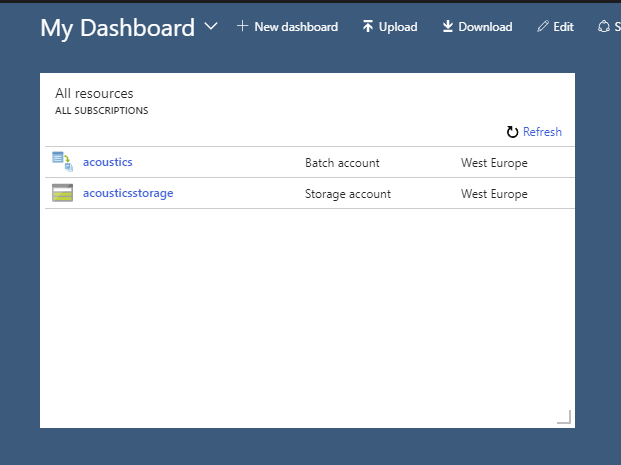
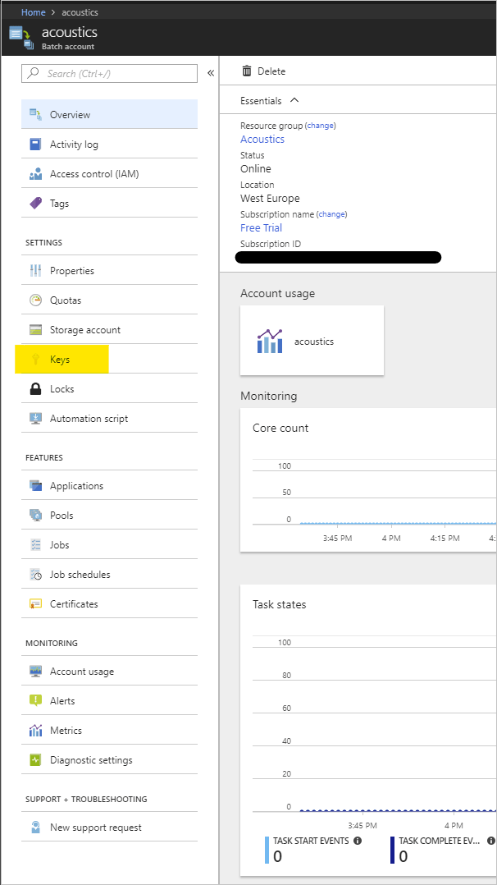
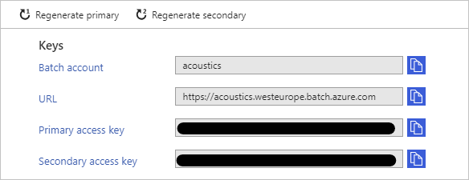
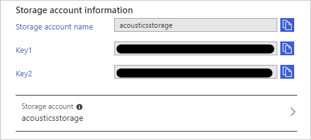

# Project Acoustics Azure Batch Account Setup

2022-10-11

#### In this article

- [Get an Azure subscription](#get-an-azure-subscription)
- [Create Azure Batch and storage accounts](#create-azure-batch-and-storage-accounts)
- [Set up acoustics bake UI with Azure credentials](#set-up-acoustics-bake-ui-with-azure-credentials)
- [Node types and region support](#node-types-and-region-support)

This how-to describes setting up an Azure Batch account for use with Project Acoustics Unity and Unreal engine integrations.

## Get an Azure subscription

An [Azure Subscription](https://azure.microsoft.com/free/) is required before setting up Batch and Storage accounts.

## Create Azure Batch and storage accounts

Next, follow [these instructions](https://learn.microsoft.com/en-us/azure/batch/batch-account-create-portal) to set up your Azure Batch and associated Azure Storage accounts. Guidance for best practices for new Batch and Storage accounts changes regularly, so refer to the linked documentation for the most up to date recommendations.

After creating a new Batch and Storage account, you can find them again on your dashboard.

## Set up acoustics bake UI with Azure credentials

By default, the Project Acoustics plugins are configured to authenticate via shared key credentials. Click on the Batch account link on the dashboard, then click on the Keys link on the Batch account page to access your credentials.

Click on the Storage Account link on the page to access your Azure Storage account credentials.

Enter these credentials in the [Unity bake plugin](../Unity/unity-baking-bake.md) or [Unreal bake plugin](../UnrealEngine/unreal-baking-bake.md).

## Node types and region support

Project Acoustics requires Fsv2- or H-series compute optimized Azure VM nodes which may not be supported in all Azure regions. Please check [this table](https://azure.microsoft.com/explore/global-infrastructure/products-by-region/) to ensure you're picking the right location for your Batch account.
Upgrading your quota

By default, Azure Batch accounts are allocated a small number of cores, on a VM-size not supported by the Project Acoustics plugins. You will need to request a quota increase for at least one of the Fsv2- or H-series compute nodes. The more nodes you request, the more parallel you'll be able to schedule the acoustics simulation, resulting in faster bake times. For more information on quotas in Azure Batch, and information on how to request a quota increase, refer to the [Batch documentation on quotas](https://learn.microsoft.com/en-us/azure/batch/batch-quota-limit).

## Next steps

- Integrate the Project Acoustics plugin into your [Unity](../Unity/unity-integration.md), [Unreal/Wwise](../UnrealEngine/unreal-wwise-integration.md), [Unreal Audio](../UnrealEngine/unreal-audio-integration.md) project
