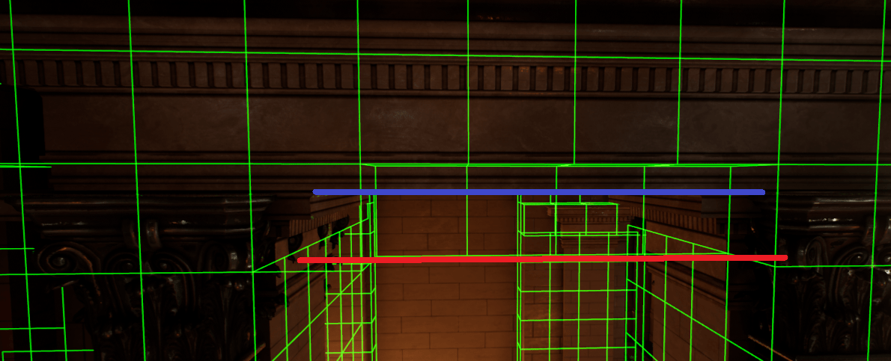
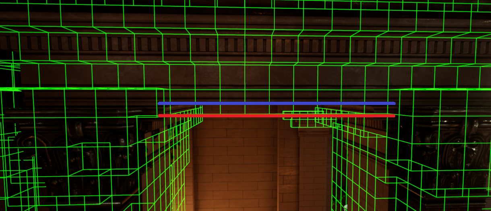

# Project Acoustics Frequently Asked Questions

2022-12-06

## What is Project Acoustics?

The Project Acoustics suite of plugins is an acoustics system that calculates sound wave behavior prior to runtime, akin to static lighting, but with support for dynamic source motion and emitted sound. The cloud does the heavy lifting of wave physics computations, so runtime CPU cost is low.

## Where can I download the plugin?

You can download the [Project Acoustics Unity plugin](https://www.microsoft.com/download/details.aspx?id=57346) or the [Project Acoustics Unreal/Wwise plugin](https://www.microsoft.com/download/details.aspx?id=58090) or the [Project Acoustics for Unreal Audio Marketplace plugin](https://unrealengine.com/marketplace/en-US/product/06cfe91228c04848a0f6d6f7fb7b40f0).

## Does Project Acoustics support <x> platform?

Project Acoustics platform support evolves based on customer needs. Please contact us on the [Project Acoustics issue forum](https://github.com/microsoft/ProjectAcoustics/issues) to inquire about support for additional platforms. If you are a game developer, you can get access to the source code and add additional platform support yourself. For source licensing information, contact your Microsoft Gaming representative and ask for the "GDK addendum agreement for the Game Development Kit Repository."

## Is Azure used at runtime?

No, cloud integration is used only during the precompute stage for acoustic content generation.

## What is simulation input?

The simulation input is your 3D scene, virtual environment or game level. Material information is associated with the scene's geometry on a per-triangle basis. You can choose which geometry and material assignments are included in the simulation with the provided editor plugins.

## What is the runtime cost?

As a rough estimate, acoustics takes about 0.01% of CPU per source per frame. RAM usage can be controlled using probe streaming to be in the tens of MB. On-disk data size depends heavily on the size of the area that the player can explore (but not the triangle count) and the sampling density chosen for probe layout. We have seen sizes ranging from tens to hundreds of MB.

## Do I need to simplify the level geometry? Control triangle count? Make meshes watertight?

No. The system will ingest detailed level geometry directly. The CPU/RAM/disk usage do not depend on triangle count. In fact, more detailed geometry can give you higher quality by modeling effects such as wave scattering/diffusion.

## What's in the runtime lookup table?

The ACE file includes a table of acoustic parameters between numerous source and listener location pairs.

## Can Project Acoustics handle moving sources?

Yes.

## Do sources or source content need to be baked?

No.

## What's the difference between coarse and fine resolution?

The only difference between the coarse and fine resolution settings is the frequency at which the simulation is performed. Fine uses a frequency twice as high as coarse. This has a number of implications on the acoustic simulation:

- The wavelength for coarse is twice as long as fine, and therefore the voxels are twice as large.
- The simulation time is directly related to the voxel size, making a coarse bake about 16 times faster than a fine bake.
- Portals (for example, doors or windows) smaller than the voxel size can't be simulated and won't pass sound through at runtime. You can see if this is happening by viewing the voxels.
- The lower simulation frequency results in decreased occlusion around corners and edges, and increased occlusion from portals.
- The larger voxels will intrude more into portals, as shown below. The first image was created using coarse, while the second is the same doorway using fine resolution. As indicated by the red markings, there is much less intrusion into the doorway using the fine setting. The blue line is the doorway as defined by the geometry, while the red line is the effective acoustic portal defined by the voxel size.

## Can Project Acoustics handle dynamic geometry? Closing doors? Walls blown away?

Starting with version 2.0, Project Acoustics has beta-level support for things like opening/closing doors and windows inside the Unreal Engine. There is currently no support for arbitrary construction/destruction of geometry. Check out the [beta documentation](../UnrealEngine/unreal-beta.md) for more information.

## Does Project Acoustics use acoustic materials?

Yes. Materials are picked from the physical material names in your level, driving absorptivity. You may also provide custom material names and absorption values.

## What do the "probes" represent?

Probes are a sampling of possible player locations. At bake time, a wave simulation is performed from each probe location to compute volumetric data representing acoustics for numerous potential dynamic source locations - for that probe. At runtime, acoustic parameters are interpolated based on input listener and source locations by consulting nearby probes and their volumetric data.

## Why spend so much compute in the cloud? What does it buy me?

Project Acoustics provides accurate and reliable acoustic parameters even for ultra-complex virtual environments. It provides smooth occlusion, obstruction, and dynamic reverb variation without the manual work of drawing and blending volumes. Because it is pre-computed, the runtime CPU cost is very low.

## What exactly happens during "baking"?

A bake consists of acoustic wave simulations of cuboid simulation regions centered at each listener probe. The results of each simulation are collated to a single asset that is used in your game.

## Is my source content secure?

Yes. Project Acoustics uses Azure resources that you've provisioned. Data does not leave those resources. Additionally, Project Acoustics does not upload raw source scene geometry to the cloud. Instead, simulation operates on a voxelization of your scene, which is combined with probe location data and stored in a proprietary format. This locally-computed voxelized representation of your scene is the only data sent to Azure.

## Next steps

- Try the [Project Acoustics Unity sample content](#), [Unreal/Wwise sample content](../UnrealEngine/unreal-wwise-sample.md), or [Unreal Audio sample content](../UnrealEngine/unreal-audio-sample.md)
