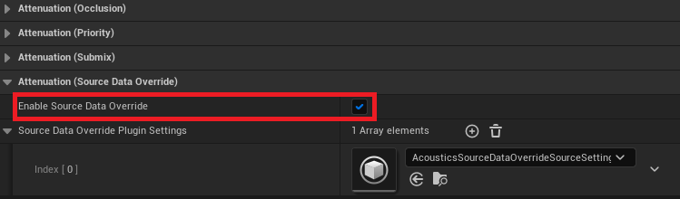

# Project Acoustics Unreal Audio Design Tutorial

2022-12-06

This article describes the design setup and workflow for the `Project Acoustics for Unreal Audio` plugin.

Software prerequisites:

- An Unreal project with the `Project Acoustics for Unreal Audio` plugin for Unreal Engine 5.

To get an Unreal project with Project Acoustics, you can:

- Follow the [Project Acoustics Unreal Audio integration](./unreal-audio-integration.md) instructions to add Project Acoustics to your Unreal project and bake a scene.
- Or, use the [Project Acoustics Unreal Audio sample project](./unreal-audio-sample.md).

## Project Acoustics for Unreal Audio Effects

The Project Acoustics Unreal Audio plugin for Unreal Engine 5 is designed to work completely within the Unreal Audio Engine, with no external middleware dependencies. The plugin is registered as a `Source Data Override` plugin. This means that you can still use other audio plugins for **Spatialization**, **Occlusion**, and **Reverb** in combination with Project Acoustics. Project Acoustics will use its acoustics data in combination with the `Source Data Override` interface to augment or completely drive your sound's spatialization, occlusion, and reverb. Read on to learn about how each effect can be utilized.

### Portalling

Using the acoustic parameters from the bake file, Project Acoustics can determine the true arrival direction of a sound source based on the geometry of the scene. This is also called the *Portalled* direction. Project Acoustics for Unreal Audio can modify the location of the sound source, and this modified location will then be passed onto whichever spatialization method you have selected. This means you can get the power of Project Acoustics geometry-aware arrival direction, in combination with your favorite spatializer. If you wish to use normal arrival direction, you should disable *Portalling* on your [actor specific design controls](#actor-specific-acoustic-design-controls).

### Occlusion

Using the acoustic parameters from the bake file, Project Acoustics can directly drive `Occlusion Attenuation` of a sound source based on the geometry of the scene. If you wish to use another **Occlusion** plugin, or not have any occlusion, you should disable occlusion on your [actor specific design controls](#actor-specific-acoustic-design-controls).

### Reverb

Using the acoustics data from the bake file, Project Acoustics can render reverb for your sound sources and adjust the reverb's loudness, duration, and direction. We support two methods for reverb for you to use:

- Project Acoustics Spatial Reverb
- UE Stereo convolution reverb

#### Project Acoustics Spatial Reverb

> [!Note]
>
> Spatial reverb for the Project Acoustics SDO plugin is only available in UE 5.1+.

Spatial reverb enables directionally-aware, object-based reverb that is rendered directly within the Source Data Override plugin. This works by spawning an array of virtual speakers (sound objects) that follow the listener but don't rotate with the listener. These virtual speakers will count towards your total voice count. Spatial reverb offers a richer and more detailed experience, with reverb coming from specific directions and having different perceived spreads.

To use Spatial Reverb, make sure you have **Reverb Type** set to `Spatial Reverb` in your `Project Acoustics SDO` project settings. **Best** quality offers the most fidelity and will use 12 virtual speakers equally spaced all around your head. **Good** offers better CPU performance and will use 3 speakers equally spaced on the horizontal plane only.

The following is a demonstration of how the virtual speakers are placed around the listener using **Best Quality**.

#### UE Stereo Convolution Reverb

Project Acoustics for Unreal Audio ships with a bank of impulse responses that are loaded into [Unreal Convolution Reverbs](https://dev.epicgames.com/documentation/en-us/unreal-engine/convolution-reverb-in-unreal-engine). These impulse responses are loaded in [Unreal Submixes](https://dev.epicgames.com/documentation/en-us/unreal-engine/overview-of-submixes-in-unreal-engine). Using the acoustic parameters and these convolution reverbs, the Project Acoustics Unreal Audio plugin will directly generate reverb for your sound source. This reverb does not pan or binauralize your sources, meaning that it is always centered.

To use this reverb, make sure you have **Reverb Type** set to `Stereo Convolution` in your `Project Acoustics SDO` settings. If you wish to use other another plugin's reverb, or not have any reverb, you should disable reverb on your [actor specific source settings](#actor-specific-acoustic-design-controls) or choose `None` as your **Reverb Type** in **Project Settings**.

You are able to supply your own impulse responses to be used in Project Acoustics Unreal Audio reverb. Open Project Acoustics in your Project Settings, Select `Custom` Reverb Bus Preset and enter your own submixes containing your **Unreal Convolution Reverbs** loaded with impulse responses. You need to supply 3 convolution reverbs, of increasing duration between 0 and 5 seconds, so that we can mix between them to produce accurate reverb duration. The duration of the actual impulse response (not the sound file), needs to be specified for each submix.

## Actor-specific acoustic design controls

There are two ways to achieve actor-specific design controls for your acoustics:

- Source Data Override Source Settings
- Acoustics Audio Component Settings

### Source Data Override Source Settings

Source design controls can be achieved with source settings that are assigned to your sound source attenuation. These design controls will be applied to whichever audio objects are assigned to this sound source attenuation.

On the [Sound Attenuation](https://dev.epicgames.com/documentation/en-us/unreal-engine/sound-attenuation-in-unreal-engine) object you have assigned to your sound object

You can assign a **Project Acoustics Source Data Override Source Setting**

Within the **SourceDataOverrideSourceSetting**, you can see the per-source acoustic design controls

- **Apply Acoustic Volumes**: Whether or not this sound source should use the settings from any surrounding Acoustic Runtime Volume. See [Acoustics Runtime Volumes](./unreal-baking-advanced.md).
- **Occlusion Multiplier**: Controls the occlusion effect. Values greater than 1 will amplify the occlusion. Values less than 1 will minimize it.
- **Wetness Adjustment**: Additional reverb dB
- **Decay Time Multiplier**: Controls the RT60 multiplicatively, based on the output of the acoustics simulation.
- **Outdoorness Adjustment**: Controls how outdoors the reverberation is. Values closer to -1 make it more indoor, values closer to +1 more it more outdoor.
- **Enable Portalling**: Enables the modification of the direction of the sound source based on acoustic geometry data.
- **Enable Occlusion**: Enables the modification of occlusion attenuation based on acoustic data.
- **Enable Reverb**: Enables the production of reverb based on acoustic data.
- **Apply Dynamic Openings**: Makes this sound source consider any dynamic opening components (currently in beta).
- **Interpolation**: See the [Interpolation Config](./advanced-debugging.md#interpolation-configuration) section.
- **Show Acoustic Parameters**: Display debug information directly on top of the component in-game. (only for non-shipping configurations)

### Acoustics Audio Component Settings

Actor-specific design controls can also be achieved with the `Acoustics Audio Component`. When adding sound sources to your scene, you can use the `Acoustics Audio Component`, which is exactly the same as the normal UE `Audio Component`, but with the addition of Project Acoustics specific design controls. `Acoustics Audio Component` settings have the benefit of being truly specific to a single source, while `Source Data Override Source Settings` can be shared between sound sources. See the previous section on [source settings](#source-data-override-source-settings) for the breakdown of design controls.

## Set up scene-wide Project Acoustics properties

The Acoustics Space actor exposes many controls that modify the behavior of the system and are useful in debugging.

- **Acoustics Data**: This field must be assigned a baked acoustics asset from the Content/Acoustics directory. The Project Acoustics plugin will automatically add the Content/Acoustics directory to your project's packaged directories.
- **Tile size**: The extents of the region around the listener that you want acoustics data loaded into RAM. As long as listener probes immediately around the player are loaded in, the results are same as loading acoustic data for all probes. Larger tiles use more RAM, but reduce disk I/O
- **Auto Stream**: When enabled, automatically loads in new tiles as the listener reaches the edge of a loaded region. When disabled, you'll need to load new tiles manually via code or blueprints
- **Cache Scale**: controls the size of the cache used for acoustic queries. A smaller cache uses less RAM, but may increase CPU usage for each query.
- **Update Distances**: Use this option if you'd like to use the pre-baked acoustics information for distance queries. These queries are similar to ray casts, but they have been pre-computed so take much less CPU. An example usage is for discrete reflections off the closest surface to the listener. To fully leverage this, you'll need to use code or Blueprints to query distances.
- **Global Design Params**: Design parameters that will be applied to all sound sources in the scene using Project Acoustics. See the previous section on [source settings](#source-data-override-source-settings) to read about these individual controls.
- **Acoustics Enabled**: A debug control to enable quick A/B toggling of the Acoustics simulation. This control is ignored in shipping configurations. The control is useful for finding if a particular audio bug originates in the acoustics calculations or some other issue in the Wwise project.
- **Draw Stats**: While UE's `stat Acoustics` can provide you with CPU information, this status display will show the currently loaded ACE file, RAM usage, and other status information in the top left of the screen.
- **Draw Source Parameters**: Allows for global control of whether source debug parameters are displayed. You can choose to leave it up to the individual sources, or you can force all source parameters to be either displayed or hidden.
- **Draw Voxels**: Overlay voxels close to the listener showing the voxel grid used during the bake step.
- **Voxel Render Distance**: How far away debug runtime voxels are rendered from the camera. Performance will drop as more voxels are rendered.
- **Draw Probes**: Show all the probes for this scene. They will be different colors depending on their load state.
- **Draw Distances**: If Update Distances is enabled, this will show a box on the closest surface to the listener in quantized directions around the listener.

## Project Acoustics in MetaSounds

Acoustic parameters can be used directly within MetaSounds to drive logic in your DSP graph. If you have Project Acoustics set up as your `Source Data Override` plugin, you will see Project Acoustics available as a new **Interface** within your MetaSound.

Once selected, this interface will allow you to place acoustic parameter input variables into your MetaSound graph. These input variables will be updated each frame with the latest acoustic parameters.

In order for these to work, make sure that `Source Data Override` has been enabled on the **Attenuation Settings** that are attached to the MetaSound itself, or the audio component hosting the MetaSound.

## Next steps

- Explore the concepts behind the [design process](../Resources/design-process.md)
- [Create an Azure account](../Resources/create-azure-account.md) to bake your own scene
- Learn about [advanced usage and debugging](./advanced-debugging.md).
