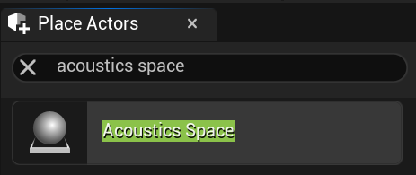

# Project Acoustics Unreal Audio Plugin Integration

2022-12-06

This article describes how to integrate the **Project Acoustics for Unreal Audio** plugin into your existing Unreal Engine 5 project. The Project Acoustics Unreal Audio plugin is designed to work completely within Unreal Audio Engine, with no external dependencies for audio rendering.

Software requirements:

- [Unreal Engine](https://www.unrealengine.com/) 5.0+
  - The Unreal Audio version of Project Acoustics only works on Unreal Engine 5.0 and later
- [Visual Studio 2022](https://visualstudio.microsoft.com/downloads/) with the following components installed:
  - .NET Framework 4.7.2+

## Download and Install the Project Acoustics Plugin

Download and install the [Project Acoustics for Unreal Audio](https://www.unrealengine.com/marketplace/en-US/product/06cfe91228c04848a0f6d6f7fb7b40f0) code plugin from the Unreal Engine Marketplace.

See Epic's page on [Working With Plugins in Unreal Engine](https://dev.epicgames.com/documentation/en-us/unreal-engine/working-with-plugins-in-unreal-engine) for more info on how to install plugins.

Unreal Engine code plugins require that the game project be a C++ project (not Blueprint only).

## Build the game and check that Python is enabled

1. Compile your game project, and make sure that it builds correctly.

2. Open your project in Unreal Editor.

You should see a new mode, which indicates that Project Acoustics has been integrated

3. Confirm that the Python plug-in for Unreal is enabled so that editor integration functions correctly.

## Audio setup in Unreal

1. First, you need to bake your game level to produce an acoustics asset, which will be placed in Content\Acoustics. Consult the [Unreal Bake Tutorial](./unreal-baking-overview.md). A pre-baked level is included in the [sample package](./unreal-audio-sample.md).

2. Create an `Acoustics Space` actor in your scene. Only create one of these actors in a level, because it represents the acoustics for the whole level.

3. Assign the baked acoustic data asset to the Acoustics data slot on the `Acoustics Space` actor. Your scene now has acoustics!

4. In Project Settings, under your target platform, Select Project Acoustics as the `Source Data Override Plugin`. The supported platforms for the Project Acoustics Source Data Override plugin include Windows and Android.

Optionally, select a `Spatialization Plugin`. Choose either the [Project Acoustics Unreal Spatializer Plugin](./unreal-audio-spatializer.md) or a spatialization plugin from another source.

5. Set up an actor with an audio component. Add attenuation settings to the audio object.

6. Within those attenuation settings, enable `Source Data Override`. This will opt-in your sound source to receive acoustic effects from your Project Acoustics bake.

You're all set. Move around the scene and explore the acoustic effects!

## Next steps

- Optionally, configure the [Project Acoustics Unreal Spatializer Plugin](./unreal-audio-spatializer.md) to render spatial audio over headphones.
- Try the [Project Acoustics Unreal Audio Design Tutorial](./unreal-audio-design.md) to learn more detail about how to use the Project Acoustics Unreal Audio plugin.
- Learn [how to do bakes](./unreal-baking-overview.md) for your game scenes.
- Learn about [advanced usage and debugging](./advanced-debugging.md).
