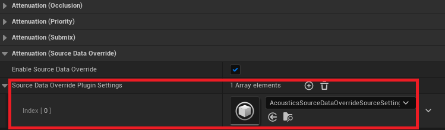
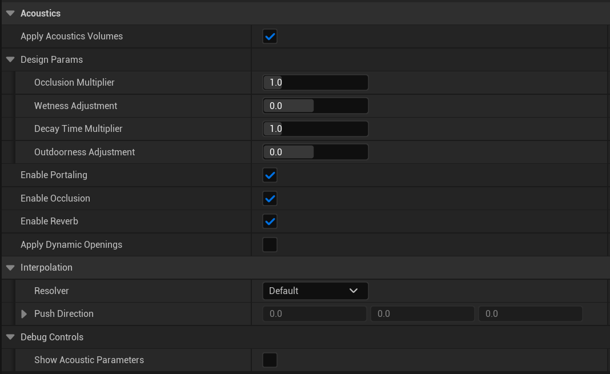

# Project Acoustics Unreal Audio sample

2022-12-06

In this sample, you'll experiment with Project Acoustics design controls by using sample content for the Unreal Audio Engine.

Software requirements for using the sample content:

- [Unreal Engine](https://www.unrealengine.com/) 5.1

## Download the sample package

Download the [Project Acoustics Sample for Unreal Engine 5](https://www.microsoft.com/en-us/download/details.aspx?id=104115). The sample package contains a single Unreal Engine project.

Make sure you have installed the [Project Acoustics for Unreal Audio](https://unrealengine.com/marketplace/en-US/product/06cfe91228c04848a0f6d6f7fb7b40f0) code plugin from the Unreal Engine Marketplace. This is not included in the sample package.

## Open the Unreal Project

When you open the Unreal project, it will prompt you to rebuild modules. Select **Yes**.

## Experiment with Project Acoustics design controls

Listen to how the scene sounds by selecting the play button in the Unreal editor. Use the W, A, S, and D keys and the mouse to move around. There is a single sound source in the scene, placed in front of the player as a white sphere. You can move the sound source and also play sounds with your gun. See the controls displayed in the upper left HUD.

The following information describes some design activities to try.

### Modify global decay time multiplier

You can modify global design parameters that will impact all sound sources on the AcousticsSpace actor. Try modifying the `Decay Time Multiplier` to see how the reverb changes. The normal reverb applied to a sound source will be multiplied by the slider value. So if the reverb for a room was normally 1.5 seconds, and your `Decay Time Multiplier` is set to 2, the reverb will be rendered at 3 seconds

### Modify per-source occlusion

Per-source design control is done through `Source Data Override Plugin Settings`. These settings can also be shared across multiple sources.

In the sample scene, you can find the per-source settings by going to the SoundSource actor and finding the *ProjectAcousticsAttenuationSettings*.

Within those settings, you can find the `Source Data Override Plugin Settings` at the bottom.

If you open the `Project Acoustics Source Data Override Settings`, you can see all the design parameters and a few other controls. Try modifying the `Occlusion Multiplier` and then moving your character around so that there is geometry between you and the sound source. The `Occlusion Multiplier` will make the source sound even more occluded if the multiplier is greater than 1, and less occluded if it is less than 1. A value of 0 will completely disable occlusion.

### Next steps

- Learn more detail about [Project Acoustics for Unreal Audio Design](unreal-audio-design.md).
- [Integrate the Project Acoustics for Unreal Audio](./unreal-audio-integration.md) plug-in into your Unreal project.
- [Create an Azure account](../Resources/create-azure-account.md) for your own bakes.
