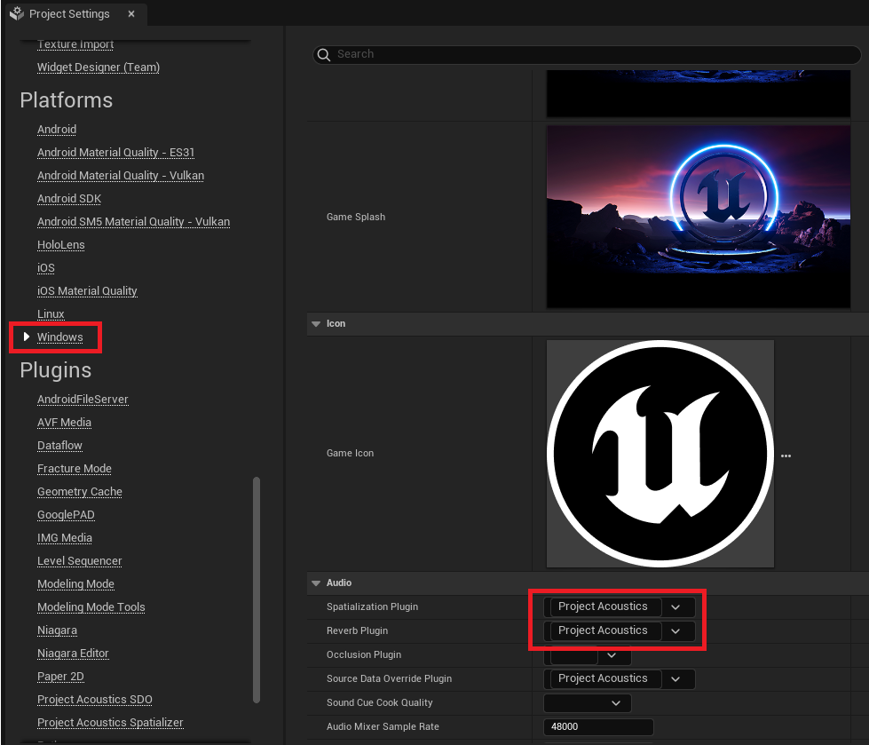
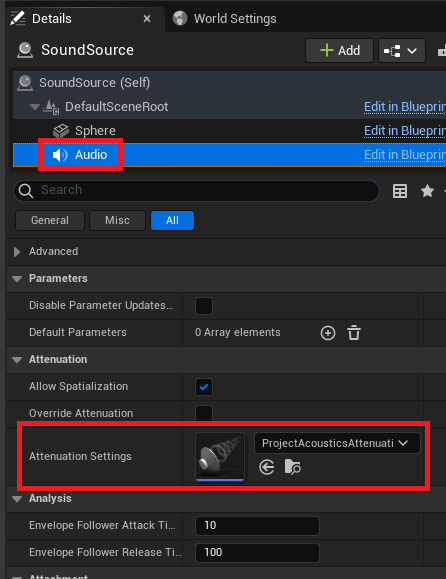

# Project Acoustics Spatializer Plugin Integration

2022-12-06

This article describes how to integrate the Project Acoustics Spatializer plugin into your existing Unreal Engine 5 project. The Project Acoustics Spatializer plugin is designed to efficiently render spatialized sounds over headphones.

## Download and Install the Project Acoustics Plugin

Download and install the [Project Acoustics for Unreal Audio](https://www.unrealengine.com/marketplace/en-US/product/06cfe91228c04848a0f6d6f7fb7b40f0) code plugin from the Unreal Engine Marketplace.

See Epic's page on [Working With Plugins in Unreal Engine](https://dev.epicgames.com/documentation/en-us/unreal-engine/working-with-plugins-in-unreal-engine) for more info on how to install plugins.

Unreal Engine code plugins require that the game project be a C++ project (not Blueprint only).

## Spatializer plugin setup in Unreal

1. In Project Settings, under your target platform, select `Project Acoustics` as the *Spatialization Plugin* and `Project Acoustics` as the *Reverb Plugin*. If both plugin options are not set to `Project Acoustics` then the spatialization plugin will not render audio.

2. In Project Settings, under the *Project Acoustics Spatializer* settings page, set the *Engine Type* to the desired quality level. *Engine Type* options include `High Quality`, `Good Quality`, and `Stereo Panning`. The `Good Quality` level is approximately twice as efficient at rendering each sound source with minimal loss of quality when compared with the `High Quality` level.

3. You'll need to select the `Allow Spatialization` option and add the appropriate `Attenuation Settings` in the Details page for the audio object.

4. Open the properties for the attentuation settings attached to the sound source and ensure that `Enable Spatialization` is selected and the *Spatialization Method* is selected as `Binaural`.

After completing the steps above, you are now ready to listen to spatialized audio over headphones for your scene.

> [!Note]
>
> While the Source Data Override plugin and the Spatializer plugin work well together, these plugins operate independent of each other and can be mixed and matched with other audio plugins.

## Next steps
- [Optional] Follow the [Project Acoustics Unreal Audio integration](./unreal-audio-integration.md) guide to integrate the Source Data Override plugin to achieve acoustic effects like reverb, occlusion, and portalling.
