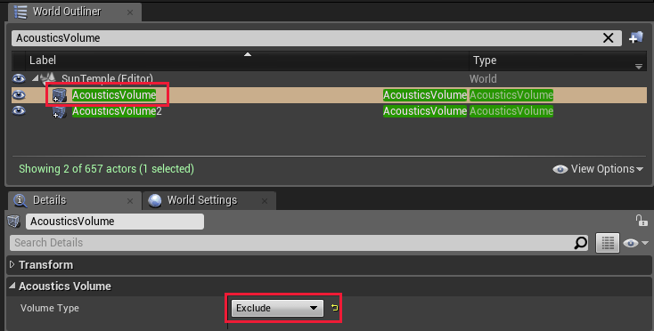
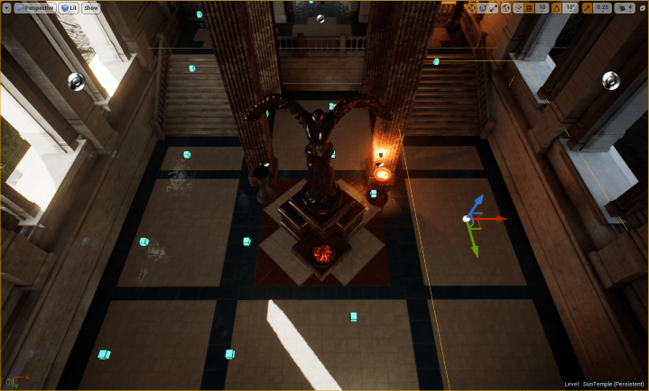
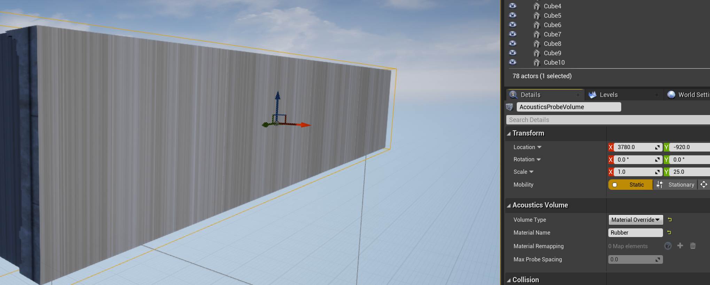
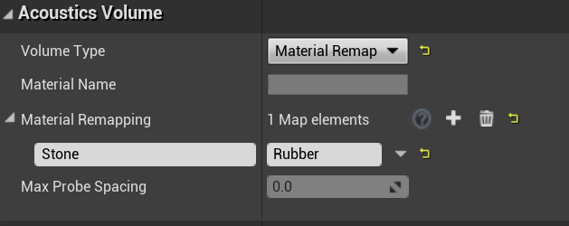
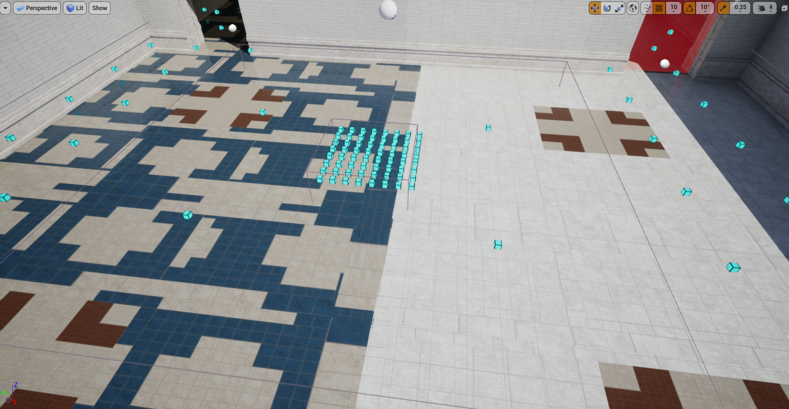
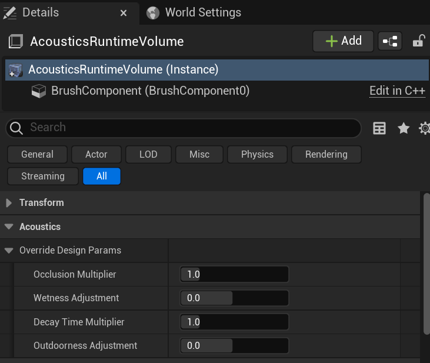
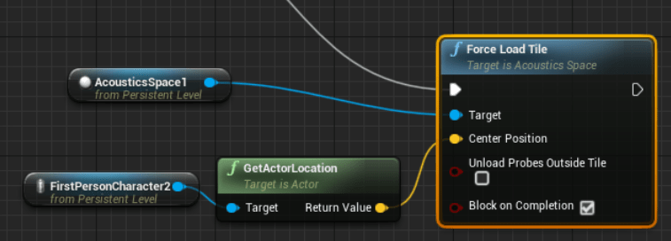
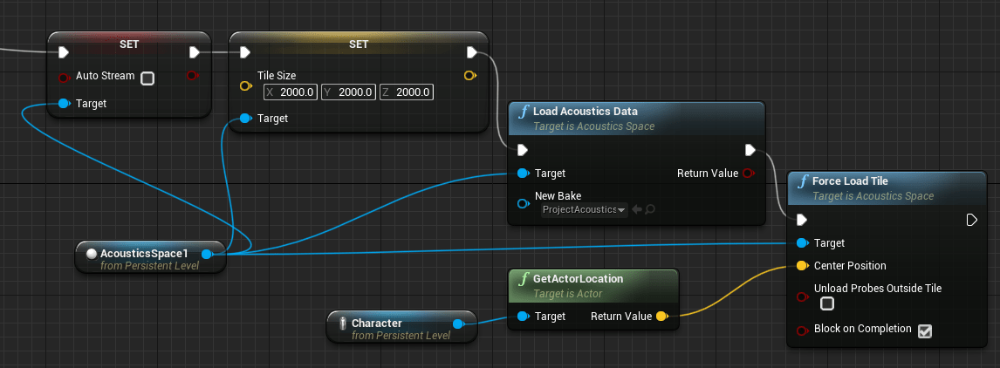
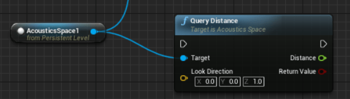

# Project Acoustics Unreal Advanced Bake Configuration

2022-05-24

This article describes the tools available to fully customize acoustic bakes. For information on how to get started with a bake, refer to the main [Unreal Baking Overview](./unreal-baking-overview.md).

## Acoustics Probe Volumes

The primary method of customizing acoustics bakes is through using **Acoustics Probe Volumes**. **Acoustics Probe Volumes** are actors you can add to your scene that allow you to modify metadata about the bake in bulk. The actor exposes a property that can be switched between `Include`, `Exclude`, `Material Override`, `Material Remap`, and `Probe Spacing`. These volumes are automatically tagged as **Acoustics Navigation** objects and included in the probe placement calculation. To have any changes to these volumes take effect, you must perform a new probe placement calculation.

`Exclude` volumes define regions where no probes should be placed. This is useful if meshes tagged for acoustic navigation have areas where the player can't actually travel to, and you don't want to split up the mesh into smaller chunks.

`Include` volumes define areas where probes should be placed. By default, the whole scene is considered for probe placement. However, if you have a very large scene, baking acoustics for the entire scene at one time may not be desirable. In this case, you can draw two big `Include` volumes in the scene and produce ACE files for each of them one at a time. To do this, manually mark one volume for Acoustics Navigation at a time, do a bake for that volume, then unmark it and repeat with the next one. Then in game, you can use trigger volumes combined with blueprint calls to load the appropriate ACE file when the player approaches each tile.

`Include` and `Exclude` volumes only modify the navigation and not the geometry. Each probe inside an `Include` volume will still pull in all the necessary geometry outside of the volume when performing wave simulations. Therefore, there shouldn't be any discontinuities in occlusion or other acoustics resulting from the player crossing from one section to another.

`Material Override` and `Material Remap` volumes allow you to update the metadata that is tagged as **Acoustics Geometry**. Any triangles that are fully contained inside these volumes will be altered. Note that large, flat planes tend to have very few triangles -- the `Acoustics Probe Volume` must fully contain the entire plane to affect the geometry's metadata. Once you have created the Material Volume and assigned a new material name, you should see that new material show up in the **Materials** tab.

`Material Override` volumes will set the material name for any meshes contained inside that volume to the specified name. For example, in this instance we set the entire wall to a "Rubber" material instead of its actual material (in this case, "Stone").

`Material Remap` volumes will do a more granular replacement. Instead of setting all meshes to a single material, you can swap one material with another. In this example, only materials labeled "Stone" will be replaced with "Rubber."

The last type of **Acoustics Probe Volume** is the `Probe Spacing` volume. Use this volume to control the spacing of probes before baking. For example, if you have a scene with mostly narrow corridors, but also a few wide open spaces, you may want to reduce the number of probes placed in the wide open spaces since the acoustics will not vary as much. To do this, use a `Probe Spacing` volume, using the `Max Probe Spacing` to adjust the density of the probes.

To demonstrate `Probe Spacing` volumes, here is an extreme example. The outer probes shown are place with the default spacing. Then there is a volume that greatly expands spacing. And inside that volume is another one that greatly decreases spacing.

## Acoustics Runtime Volumes

You may find yourself wanting to update the design controls for many actors at once. For example, maybe all actors located inside a particular room should have more reverb. You could manually adjust each actor's `Wetness Adjustment`, or you could use an `Acoustics Runtime Volume`. These volumes have all the same design controls that the `Acoustics Audio Component` does. Any `Acoustics Audio Component`s that lie inside one of these volumes will get the design control settings from the volume applied.

## Blueprint functionality

The Acoustics Space actor is accessible via blueprint, providing functionality such as loading a map or modifying settings via level scripting. We provide two examples here.

### Add finer-grained control over streaming load

To manage the acoustic data streaming yourself instead of streaming automatically based on player position, you can use the Force Load Tile blueprint function:

- **Target**: The AcousticsSpace actor
- **Center Position**: The center of the region that needs data loaded
- **Unload Probes Outside Tile**: If checked, all probes not in the new region will be unloaded from RAM. If unchecked, the new region is loaded into memory while leaving the existing probes also loaded into memory
- **Block on Completion**: Makes the tile load a synchronous operation

Tile size must already be set before calling Force Load Tile. For example, you could do something like this to load an ACE file, set your tile size, and stream in a region:

The Load Acoustics Data blueprint function used in this example has the following parameters:

- **Target**: The AcousticsSpace actor.
- **New Bake**: The acoustics data asset to be loaded. Leaving this blank/setting it to null will unload the current bake without loading a new one.

### Optionally query for surface proximity

If you want to see how close surfaces are in a particular direction around the listener, you can use the Query Distance function. This function can be useful for driving directional delayed reflections, or for other game logic driven by surface proximity. The query is less expensive than a ray-cast because the results are pulled from the acoustics lookup table.

- **Target**: The AcousticsSpace actor
- **Look Direction**: The direction to query in, centered at the listener
- **Distance**: If query succeeds, the distance to the closest surface
- **Return Value**: Boolean - true if query succeeded, otherwise false

## Next steps

- Explore the [design controls for Unreal/Wwise](./unreal-wwise-design.md)
- Explore the [design controls for Unreal Audio](./unreal-audio-design.md)
- Explore the [Project Acoustics design concepts](../Resources/design-process.md)
