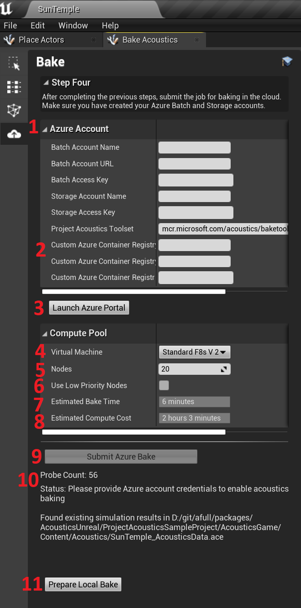
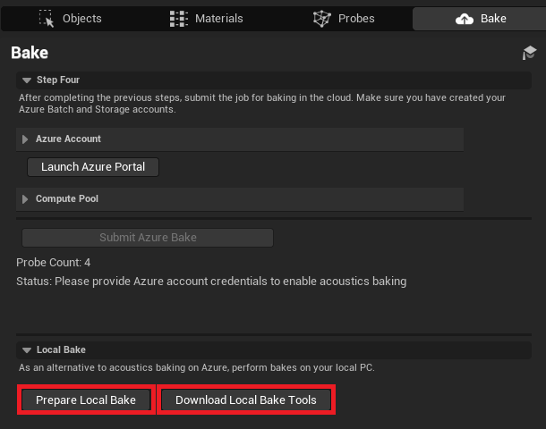
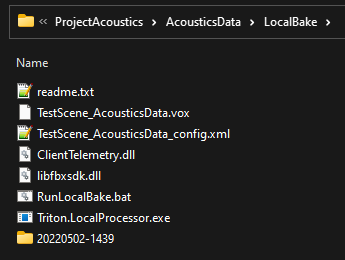

# Project Acoustics Unreal Baking - Bake Submission

2022-10-11

This article describes the Baking step of the Project Acoustics Unreal workflow.

## Bake your level using Azure Batch

You can bake your scene with a compute cluster in the cloud using the Azure Batch service. The Project Acoustics Unreal plugin connects directly to Azure Batch to instantiate, manage, and tear down an Azure Batch cluster for each bake. On the Bake tab, enter your Azure credentials, select a cluster machine type and size, and click Bake.

## Bake Tab Reference

1. Fields to enter your Azure Credentials once your Azure account has been created. For more information, see [Create an Azure Batch Account](../Resources/create-azure-account.md).
2. Leave the Custom Azure Container Registry sections blank unless instructed to change them by a Project Acoustics developer.
3. Launch Azure portal to manage your subscriptions, monitor usage and view billing information etc.
4. Azure batch compute node type to use for the calculation. The node type must be supported by your Azure data center location. If not sure, leave at `Standard_F8s_v2`.
5. Number of nodes to use for this calculation. The number you enter here affects the time to complete the bake and is limited by your Azure Batch core allocation. The default allocation only allows for two 8 core nodes or one 16 core node, but can be expanded. For more information on core allocation constraints, see [Create an Azure Batch Account](../Resources/create-azure-account.md).
6. Select this checkbox to configure your compute pool to use [low-priority nodes](https://learn.microsoft.com/en-us/azure/batch/batch-spot-vms). Low-priority compute nodes have much lower cost but they may not always be available or may be preempted at any time.
7. The amount of elapsed time it is expected to take for your job to run in the cloud. This does not include node startup time. Once the job starts running, this is about how long it should be before you get back the results. Note that this is only an estimate.
8. The total amount of computing time needed to run the simulations. This is the total amount of node compute time that will be used in Azure. See [Estimating bake cost](#Estimating-bake-cost) below for more information on using this value.
9. Click the Bake button to submit the bake to the cloud. While a job is running, this shows **Cancel Job** instead. If there are any errors on this tab, or if the workflow on the **Probes** tab has not been completed, this button will be disabled.
10. Information about the bake job is displayed here
11. This button prepares data for baking on your local PC, instead of submitting to Azure.

You can always get complete information about active jobs, compute pools, and storage at the [Azure portal](https://portal.azure.com/).

While a job is running the **Bake** button changes to **Cancel Job**. Use this button to cancel the job in progress. Canceling a job cannot be undone, no results will be available, and you will still be charged for any Azure compute time used prior to cancellation.

Once you've started a bake, you can close Unreal. Depending on the project, node type, and number of nodes, a cloud bake can take several hours. The bake job status will be updated when you reload the project and open the Acoustics window. If the job has completed, the output file will be downloaded.

The Azure credentials are stored securely on your local machine and associated with your Unreal project. They are used solely to establish a secure connection to Azure.

## Estimating Azure bake cost

To estimate what a given bake will cost, take the value shown for **Estimated Compute Cost**, which is a duration, and multiply that by the hourly cost in your local currency of the **VM Node Type** you selected. The result will not include the node time needed to get the nodes up and running. For example, if the compute node you selected has a cost of $0.40/hr, and the Estimated Compute Cost is 3 hours and 57 minutes. The estimated cost to run the job will be `$0.40 * ~4 hours = ~$1.60`. The actual cost will vary based on the actual compute time used. You can find the hourly node cost on the [Azure Batch Pricing](https://azure.microsoft.com/pricing/details/virtual-machines/linux/) page (select **Compute optimized** or **High performance compute** for the category).

## Adding the bake to the scene

After the bake completes, the bake file (the .ACE file) needs to be added to the scene. To do this, add an `Acoustics Space` actor anywhere in the scene, and assign the bake file to the `Acoustics Data` property.

The Acoustics Space actor has a transform so it can now be dragged / dropped into your scene. This can be used to help align your ACE file to the world when using World Composition / Partitioning in Unreal. Setting the transform to have a position of 0,0,0 will place it at your world origin.

## Local Bake

If you are working on small scenes or are just getting familiar with the technology, you can also perform the Acoustics bake locally on your own PC. This process involves a couple manual steps done outside the editor.

1. Select the `Prepare Local Bake` button and choose a directory to perform the local bake. Your data and config files will be placed here.
2. Select the `Download Local Bake Tools` button. This will take you to our download site where you can download the required tools to perform local bakes. **Download, unzip, and place all these files into the same local bake directory created above.** Your local bake directory should look something like this:

3. Run the RunLocalBake.bat script to kick off your local bake. This will create a timestamped directory where the local bake is run. When the script has finished, the .ACE file will be located in this directory.
4. You will need to manually import the resulting .ACE file into your project's `Content/Acoustics` directory. It must be placed in this directory.

## Data files

There are four data files created by this plugin at various points. Only one of them is needed at runtime and is placed in your project's Content/Acoustics folder, which is automatically added to your project's packaging path. The other three are inside the Acoustics Data folder and are not packaged.

- `[Project]/Config/ProjectAcoustics.cfg`: This file stores the data you enter in fields in the Acoustics Mode UI. The location and name of this file can't be changed. There are other values stored in this file that affect the bake, but they are for advanced users and should not be changed.
- `[Project]/Content/Acoustics/[LevelName]_AcousticsData.ace`: This file is what is created during the bake simulation, and contains the lookup data used by the runtime to render the acoustics of your scene. The name of this file can be changed using the fields on the `Probes` Tab. If you want to rename this file after it has been created, delete the UAsset from your Unreal project, rename the file outside of Unreal in File Explorer, and then re-import this file into Unreal to produce a new UAsset. Renaming the UAsset by itself will not work. **ACE files must be located in the Content/Acoustics directory.**
- `[Project]/Plugins/ProjectAcoustics/AcousticsData/[LevelName]_AcousticsData.vox`: This file stores the voxelized acoustics geometry and the material properties. Computed using the `Calculate` button on the `Probes` Tab. The location and name of this file can be changed using the fields on the `Probes` Tab.
- `[Project]/Plugins/ProjectAcoustics/AcousticsData/[LevelName]_AcousticsData_config.xml`: This file stores parameters computed using the `Calculate` button on the `Probes` Tab. The location and name of this file can be changed using the fields on the `Probes` Tab.

Take care not to delete the *.ace file downloaded from Azure. This file isn't recoverable except by rebaking the scene.

## Azure Logs

Logs from the acoustic bake done in Azure are automatically downloaded to your project. These can be helpful in triaging failed bakes. These logs can be found in the following directory: `[Project]/Saved/Logs/uepa[timestamp]/Logs`.
