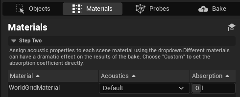

# Project Acoustics Unreal Bake Overview

2022-05-19

This article gives a brief overview of how to create an acoustics bake for a scene in Unreal.

## Open the Project Acoustics editor mode

Import the Project Acoustics plugin package to your project. For help with this, see the Unreal Integration pages for [Unreal/Wwise](./unreal-wwise-integration.md) or [Unreal Audio](./unreal-audio-integration.md). Once the plugin is integrated, open the Acoustics UI by clicking the new Acoustics Mode icon.

The four steps to doing a bake are separated into four tabs: **Objects**, **Materials**, **Probes**, **Bake**

## 1. Objects

Tag all the objects you want included in the acoustic simulation as acoustic **Geometry**. Tag your navigation mesh or floor objects as acoustic **Navigation** to indicate where the player can move in a level.

See the [Objects](#) page for more details

## 2. Materials

For each of the materials that have been tagged as acoustics **Geometry**, assign an acoustic material that defines how reflective or absorbent that material should sound.

See the [Materials](#) page for more details

## 3. Probes

Specific your simulation resolution, file names and paths, and then start the probe placement and voxel **Calculation**. This should take a few seconds to a few minutes, depending on the size of scene and the simulation resolution. Once completed, preview the voxels and probes in the scene to make sure you have the coverage you expect.

See the [Probes](#) page for more details

## 4. Bake

Once you've verified the probes and voxels, you can fill in your Azure credentials and submit a bake. You can also start a local bake as well (takes much longer).

See the [Bake](./unreal-baking-bake.md) page for more details

