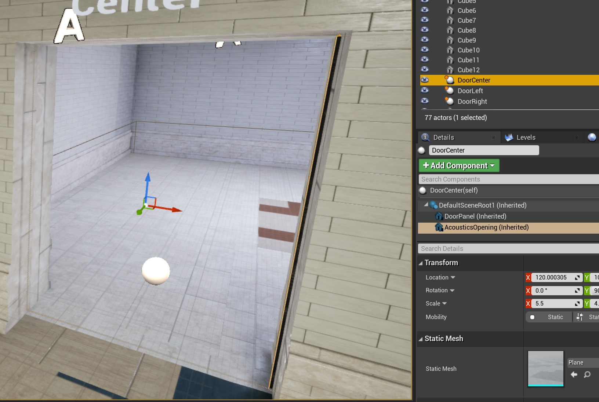

# Project Acoustics Unreal Beta Features

2022-05-19

This article describes the beta features available in Project Acoustics version 2.0. While these features are tested and stable, they come with a known set of limitations, described in detail below. We'd love to get your feedback on these features! Let us know what you think over on our [forum](https://github.com/microsoft/ProjectAcoustics/issues).

## Dynamic Openings

There is an early version of support for dynamic openings, such as doors or windows. It is a combination of bake time and run-time computation. At bake time, you inform the system of all dynamic openings which may close at runtime. At runtime, for each source with dynamic openings enabled, we use baked data to quickly find the openings lying on the shortest path from source to listener, and apply dynamic occlusion from the last opening (which is the one the listener will hear the sound come from). The feature is designed to address the most common issue of hearing a sound loudly straight through a closed door. We are researching methods for more advanced cases with many parallel doors and occlusion based on reverberant paths (not just shortest).

### Baking Openings

There is some manual markup required to enable this feature. Before baking your scene, you must add `Acoustics Dynamic Opening` components to actors in your scene. The opening should be left unobstructed during baking, free from any geometry. For instance, if the default state of the door is closed, the geometry representing the door panel should be excluded during the bake. The `Acoustics Dynamic Opening` component must fill the entire opening. It does not need to be pixel-exact, but should err on the side of slightly too big rather than slightly too small. Manual markup effort can be reduced (or potentially removed entirely) by adding the `Acoustics Dynamic Opening` component to the blueprint class for any doors or windows, as in our example scene.

### Opting-in to doors

In this beta, using doors incurs CPU overhead due to additional internal acoustic queries that must be performed for each source. Because of this, audio sources ignore doors by default. You must opt-in any audio sources that you want to be affected by dynamic doors. To do this, check the `Apply Dynamic Openings` checkbox on the `Acoustics Audio Component` of the sound source.

### Applying occlusion effects from doors

At runtime, you must inform Project Acoustics of the current state of all doors in the scene. This is done by setting the three parameters on the `Acoustics Dynamic Opening` component: *Dry Attenuation Db*, *Wet Attenuation Db*, and *Filtering*. These must be updated every time the door state changes.

- *Dry Attenuation Db* - how much attenuation should be applied to the direct path sound as a result of the door state? A value of 0 dB means no attenuation, with more negative values meaning more attenuation.
- *Wet Attenuation Db* - how much attenuation should be applied to the reverb as a result of the door state? A value of 0 dB means no attenuation, with more negative values meaning more attenuation.
- *Filtering* - how much filtering should be done? A value of 0 means no filtering, a value of 1 means maximum filtering. The interpretation of this value is completely up to you. In our example scene, we have this value directly drive a low-pass filter via an RTPC, but you can use this value for any signal processing you like.

For an example of how to update these properly, look at the blueprints included in the sample project, described below.

## Doors sample

Open the **Doors Gym** level included in the [Unreal/Wwise Sample Project](./unreal-wwise-sample.md). In this level, there are three doors. Select one of them in the **World Outliner** and open up its blueprint.

This blueprint combines automated door open/close behavior, as well as informing the Project Acoustics plugin about the door state on each tick. Let's break down what each part of the blueprint does.

### Open/Close the door

The first part of the blueprint determines the door state. This section simply determines if the door should slide more open or closed on this frame. If the door reaches all the way open or all the way closed, it changes direction. i.e. if it was opening and is now fully open, on the next Tick event it will start to close.

### Drive acoustic parameters based on door state

The second part of the blueprint determines how much attenuation should be applied because of the door's current state. Here is where you design how the door should sound. The sample has the door occluding both the dry and wet paths by the same amount, based on how closed the door is. For example, if the door is fully closed, `Door Closure Ratio` will be 1.0, so both Dry and Wet Attenuation dB get set to `10 * log10(0.01) = -20dB`.

### Update door in-game

The final part of the blueprint makes the door move in-game by a fixed amount each frame.

### Known limitations

This solution works well for doors that are in series. However, when switching between parallel doors you may experience jarring acoustic effects. This is an active research area for us, and we will eliminate this behavior in a future release.
