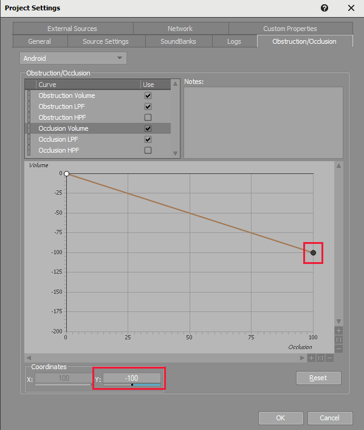
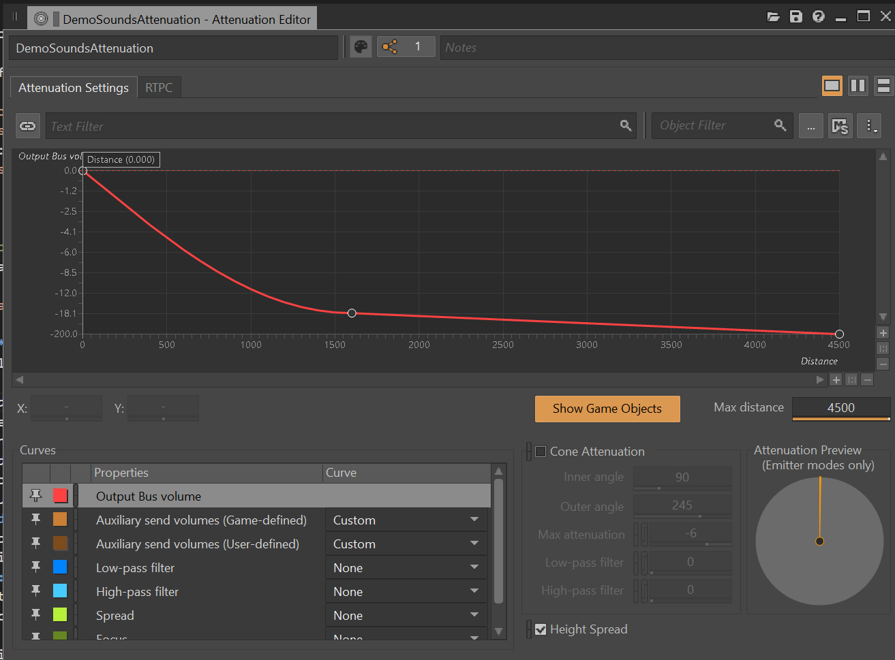
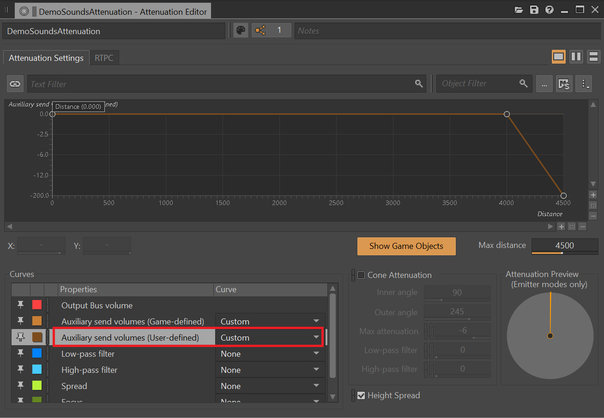
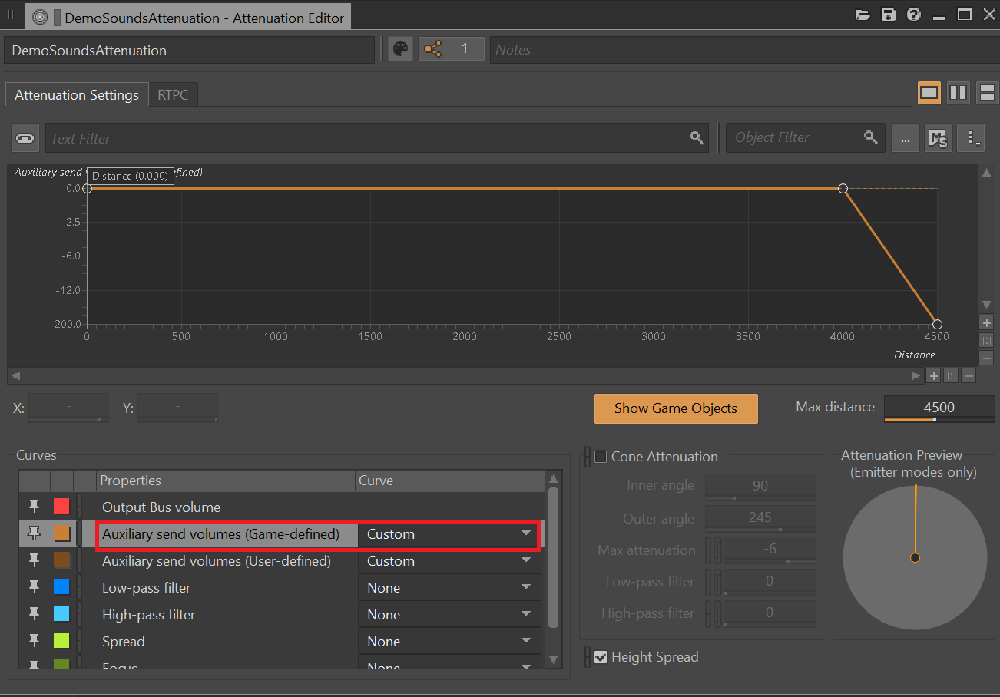
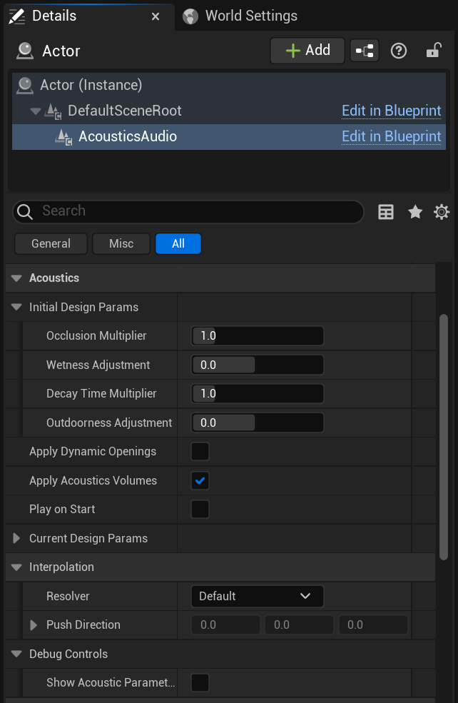

# Project Acoustics Unreal and Wwise Design Tutorial

2022-12-06

This article describes the design setup and workflow for Project Acoustics in Unreal and Wwise.

Software prerequisites:

- An Unreal project with the Project Acoustics Wwise and Unreal plugins

To get an Unreal project with Project Acoustics, you can:

- Follow the [Project Acoustics Unreal integration](./unreal-wwise-integration.md) instructions to add Project Acoustics to your Unreal project
- Or, use the [Project Acoustics Unreal/Wwise sample project](./unreal-wwise-sample.md).

## Setup project-wide Wwise properties

Wwise has global obstruction and occlusion curves that affect how the Project Acoustics plugin drives the Wwise audio DSP.

### Design Wwise occlusion and obstruction curves

When Project Acoustics is active it responds to the volume, low-pass filter (LPF) and high-pass filter (HPF) curves you set in Wwise for both occlusion and obstruction. We recommend setting your volume curve type to linear with a value of -100 dB for an Occlusion/Obstruction value of 100.

With this setting, if the Project Acoustics simulation computes an occlusion of -18 dB, it will input to the below curve at X=18, and the corresponding Y value is the attenuation applied. To do half occlusion, set the endpoint to -50 dB instead of -100 dB, or to -200 dB to exaggerate occlusion. You can tailor and fine-tune any curve that works best for your game.

### Set up distance attenuation curves

By default, the Project Acoustics simulation has a radius of 45 meters around the player location. We generally recommend setting your attenuation curve to -200 dB around that distance. This distance isn't a hard constraint. For some sounds like weapons you might want a larger radius. In such cases, the caveat is that only geometry within 45 m of the player location will participate. If the player is in a room and a sound source is outside the room and 100m away, it will be properly occluded. If the source is in a room and the player is outside and 100 m away, it won't be properly occluded.

### Wet path

Ensure any attenuation curve used by actor-mixers using Project Acoustics have game-defined aux sends (if using **Wwise convolution reverb**) or user-defined aux sends (if using **Project Acoustics Spatial Reverb**) set to **Custom**. Draw a horizontal line, starting at 0.0, and ending with a desired rolloff.

In most cases, reverberation will carry farther than dry audio as expected, guided by scene geometry. At a certain distance however, you might want all of a sound to fade out completely. In such a case you can add a rolloff on the auxiliary send volume, as shown below.

For **Project Acoustics Spatial Reverb** (User-defined):

For **Wwise convolution reverb** (Game-defined):

## Set up scene-wide Project Acoustics properties

The Acoustics Space actor exposes many controls that modify the behavior of the system and are useful in debugging.

- **Acoustics Data**: This field must be assigned a baked acoustics asset from the Content/Acoustics directory. The Project Acoustics plugin will automatically add the Content/Acoustics directory to your project's packaged directories.
- **Tile size**: The extents of the region around the listener that you want acoustics data loaded into RAM. As long as listener probes immediately around the player are loaded in, the results are same as loading acoustic data for all probes. Larger tiles use more RAM, but reduce disk I/O
- **Auto Stream**: When enabled, automatically loads in new tiles as the listener reaches the edge of a loaded region. When disabled, you'll need to load new tiles manually via code or blueprints
- **Cache Scale**: controls the size of the cache used for acoustic queries. A smaller cache uses less RAM, but may increase CPU usage for each query.
- **Update Distances**: Use this option if you'd like to use the pre-baked acoustics information for distance queries. These queries are similar to ray casts, but they have been pre-computed so take much less CPU. An example usage is for discrete reflections off the closest surface to the listener. To fully leverage this, you'll need to use code or Blueprints to query distances.
- **Global Design Params**: Design parameters that will be applied to all sound sources in the scene using Project Acoustics. See the section on [audio component controls](#actor-specific-acoustic-design-controls) to read about these individual controls.
- **Acoustics Enabled**: A debug control to enable quick A/B toggling of the Acoustics simulation. This control is ignored in shipping configurations. The control is useful for finding if a particular audio bug originates in the acoustics calculations or some other issue in the Wwise project.
- **Draw Stats**: While UE's `stat Acoustics` can provide you with CPU information, this status display will show the currently loaded ACE file, RAM usage, and other status information in the top left of the screen.
- **Draw Source Parameters**: Allows for global control of whether source debug parameters are displayed. You can choose to leave it up to the individual sources, or you can force all source parameters to be either displayed or hidden.
- **Draw Voxels**: Overlay voxels close to the listener showing the voxel grid used during the bake step.
- **Voxel Render Distance**: How far away debug runtime voxels are rendered from the camera. Performance will drop as more voxels are rendered.
- **Draw Probes**: Show all the probes for this scene. They will be different colors depending on their load state.
- **Draw Distances**: If Update Distances is enabled, this will show a box on the closest surface to the listener in quantized directions around the listener.

## Actor-specific acoustics design controls

These design controls are scoped to an individual audio component in Unreal.

- **Occlusion Multiplier**: Controls the occlusion effect. Values greater than 1 will amplify the occlusion. Values less than 1 will minimize it.
- **Wetness Adjustment**: Additional reverb dB
- **Decay Time Multiplier**: Controls the RT60 multiplicatively, based on the output of the acoustics simulation.
- **Outdoorness Adjustment**: Controls how outdoors the reverberation is. Values closer to -1 make it more indoor, values closer to +1 more it more outdoor.
- **Apply Dynamic Openings**: Makes this sound source consider any dynamic opening components (currently in beta).
- **Apply Acoustics Volumes**: Makes the sound source apply design adjustments based on any Acoustics Runtime Volumes it is inside of.
- **Play on Start**: Toggle to specify whether the sound should automatically play on scene start. Enabled by default.
- **Interpolation**: See the [Interpolation Config](./advanced-debugging.md#interpolation-configuration) section.
- **Show Acoustic Parameters**: Display debug information directly on top of the component in-game. (only for non-shipping configurations)

Note the distinction between Initial Design Params and Current Design Params. This split is because of how Unreal handles updating parameters via UI during Play Mode. Namely, any adjustments you make will cause that component to be reinitialized from scratch. This makes it hard to demo design adjustments in real-time. Because of this, you should adjust the Initial Design Params while outside of Play Mode. During Play Mode, you can update the Current Design Params via code or blueprint to audition changes in real-time.

## Next steps

- Explore the concepts behind the design process.
- Create an Azure account to bake your own scene.
- Learn about advanced usage and debugging.
