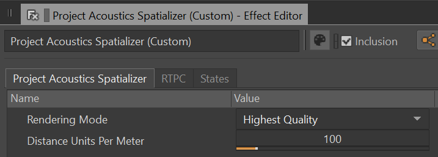
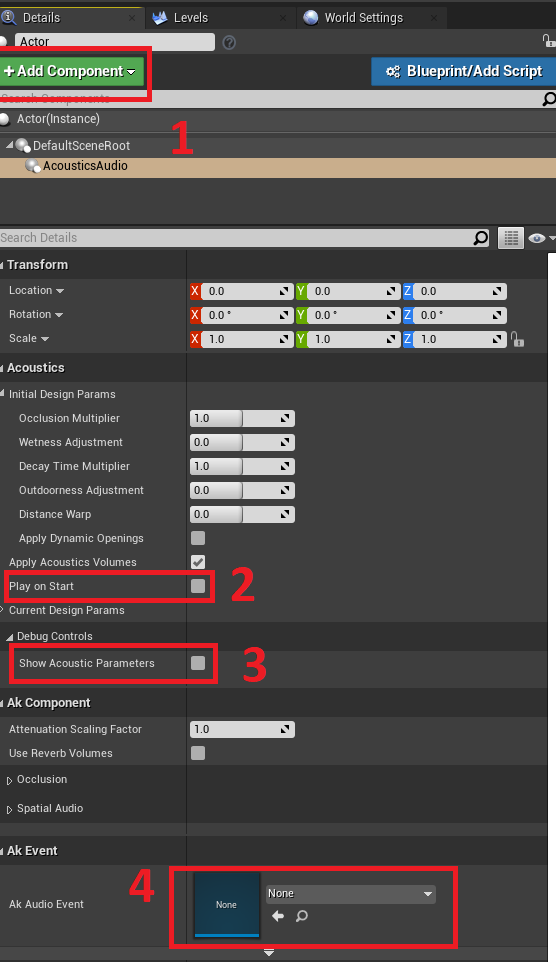

# Project Acoustics Unreal and Wwise Integration

2022-05-24

This article describes how to integrate the Project Acoustics plug-in package into your existing Unreal and Wwise game project.

Software requirements:

- Unreal Engine 4.26+
- AudioKinetic Wwise 2021.1+
- Wwise plug-in for Unreal

If you're using a direct integration of the Wwise SDK instead of the Wwise Unreal plug-in, consult the Project Acoustics Unreal plug-in and adjust Wwise API calls.

To use Project Acoustics with an audio engine other than Wwise, make an enhancement request in the [Project Acoustics discussion forum](https://github.com/microsoft/ProjectAcoustics/issues). You can use the Project Acoustics Unreal plug-in as a sample of how to query acoustics data and make API calls to your engine.

## Download Project Acoustics

Download the [Project Acoustics Unreal and Wwise plug-in package](https://www.microsoft.com/download/details.aspx?id=58090) if you haven't already.

An Unreal Engine plug-in and a Wwise mixer plug-in are included in the package. The Unreal plug-in provides editor and runtime integration. During gameplay, the Project Acoustics Unreal plug-in computes parameters such as occlusion for each game object for each frame. These parameters are translated into Wwise API calls.

## Install the Project Acoustics plug-in for Wwise

1. Open the Wwise launcher. On the **Plug-ins** tab, under **Install New Plug-ins**, select **Add from Directory**.


2. Select the AcousticsWwisePlugin\ProjectAcoustics directory that's in the download package. It contains the Wwise plug-in bundle.

Wwise will install the plug-in. Project Acoustics should appear on the installed plug-ins list in Wwise.


## Redeploy Wwise into your game

Redeploy Wwise into your game even if you've already integrated Wwise. This step adds the Project Acoustics Wwise plug-in to any existing integration.

> [!Note]
>
> **Engine plug-in**: If you have Wwise installed as a game plug-in in an Unreal C++ project, skip this step. If it's installed instead as an engine plug-in, for instance because your Unreal project is Blueprint only, Wwise deployment with our plug-in is more complex. Create a dummy empty Unreal C++ project. Close the Unreal editor if it opens and follow the remaining procedure to deploy Wwise into the dummy project. Then, copy out the deployed Wwise plug-in.

1. From the Wwise launcher, select the **Unreal Engine** tab. Select the "hamburger" (icon) menu next to **Recent Unreal Engine Projects** and then select **Browse for project**. Open your game's Unreal project .uproject file.


2. Select **Integrate Wwise in Project** or **Modify Wwise in Project**. This step integrates Wwise binaries into your project, including the Project Acoustics plug-in for Wwise.

> [!Note]
>
> **Engine plug-in**: If you're using Wwise as an engine plug-in and you created the dummy project as described earlier, copy the folder that Wwise deployed: [DummyUProject]\Plugins\Wwise. Paste it over [UESource]\Engine\Plugins\Wwise. [DummyUProject] is the empty Unreal C++ project path, and [UESource] is where the Unreal Engine sources are installed. After you copy the folder, you can delete the dummy project.

## Add the Project Acoustics Unreal plug-in to your game

1. Copy the Unreal\ProjectAcousticsWwise folder from the downloaded plug-in package to your project's directory, e.g. [UProjectDir]\Plugins\ProjectAcousticsWwise, where [UProjectDir] is your game's project folder that contains the .uproject file.

> [!Note]
>
> Engine plug-in: If you're using Wwise as an engine plug-in, you should use Project Acoustics as an Unreal engine plug-in as well. Instead of the destination directory cited previously, use [UESource]\Engine\Plugins\ProjectAcousticsWwise.

2. Confirm that you see a Wwise folder alongside the ProjectAcousticsWwise folder. It contains the Wwise plug-in along with binaries for the mixer plug-in that you deployed earlier.

## Extend Wwise Unreal plug-in functionality

The Project Acoustics Unreal plug-in requires additional behavior exposed from the Wwise Unreal plug-in API per these [guidelines](https://www.audiokinetic.com/library/?source=UE4&id=using__initialsetup.html). We've included a batch file to automate the patching procedure.

- Inside Plugins\ProjectAcousticsWwise\Resources, run PatchWwise.bat.

## Build the game and check that Python is enabled

1. Compile your game, and make sure that it builds correctly. If it doesn't build, check the previous steps carefully before you continue.

2. Open your project in Unreal Editor.

> [!Note]
>
> **Engine plug-in**: If you're using ProjectAcoustics as an engine plug-in, also make sure that it's enabled under "built-in" plug-ins.

You should see a new mode, which indicates that Project Acoustics has been integrated.


3. Confirm that the Python plug-in for Unreal is enabled so that editor integration functions correctly.


## Set up your Wwise project to use Project Acoustics

An example Wwise project is included in the samples download. We recommend that you view it along with these instructions. The screenshots later in this article are from this project. There are many options for integrating Project Acoustics with Wwise. All options are represented within the sample project, although some of them are disabled by default.

## Dry Path

There are two primary options for dry path rendering: the `Project Acoustics Spatializer` plug-in, or `Wwise's built-in 3D audio support`. If you are looking for a fully cross-platform HRTF solution for headphones, we recommend using the `Project Acoustics Spatializer`. Otherwise, we recommend using `Wwise's built-in 3D audio support`.

### Project Acoustics Spatializer (for headphones only)

The Project Acoustics Spatializer is not compatible with using Wwise's built-in 3D Audio support. You must pick one or the other.

Set an audio bus to the `Audio Objects` configuration.


Go the the Effects tab, and add the `Project Acoustics Spatializer`.


Open the effect settings, and set Distance Units Per Meter appropriately based on your game engine. For example, if you are using Unreal Engine, set this to 100. If you are using Unity, set this to 1.



### Wwise's built-in 3D Audio support

Wwise's built-in 3D audio support is not compatible with the Project Acoustics Spatializer. You must pick one or the other.

Open the settings panel for the System Audio Device. Check the boxes for "Allow 3D Audio" and "Allow System Audio Objects," as shown below.


For more information on 3D audio support in Wwise, refer to [Audiokinetic's documentation](https://www.audiokinetic.com/library/edge/?source=Help&id=system_audio_device).

## Wet Path

There is currently only a single supported method for reverb -- using banks of Wwise Convolution Reverb effects. Future updates will allow for more options. The first thing to do is import the Project Acoustics factory assets. From the Project menu, choose "Import Factory Assets."


Then choose Project Acoustics from the list of available assets.


### Wwise Convolution Reverb

> [!Note]
>
> Wwise Convolution Reverb is a plug-in on top of the base Wwise installation. Make sure you have it installed via the Wwise Launcher before proceeding.

> [!Note]
>
> **Licensing** Wwise Convolution Reverb requires a license. Contact your Audiokinetic representative to obtain a license.

Before beginning, it is good practice to ensure the Factory Assets were imported properly. Most Wwise projects will be OK, but some custom configurations may have lost the link to the impulse responses necessary inside the convolution reverb presets. In Wwise, navigate to the ShareSets tab. Under Effects, expand `ProjectAcoustics`. Click through each of the Convolution_ presets and ensure that the impulse response is populated in the effect window. If any are missing, you'll need to manually relink them. The impulse responses will be in your project's `Originals/Plugins/Wwise Convolution Reverb` directory.

There is a python script included in the Wwise plugin bundle, named `SetupWwiseBusses.py`. This script uses the Wwise Authoring API (WAAPI) to configure Wwise convolution reverb on your behalf. Appropriate Impulse Responses are included in the Project Acoustics Factory Assets. This script creates the required aux busses and adds instances of Wwise Convolution Reverb with the expected impulse response populated. You may swap out these impulse responses for your own at any time. If you want to go back to default settings, the fastest thing to do is to delete the entire tree of aux busses and re-run `SetupWwiseBusses.py`.

To run the script, ensure you have Python 3 installed. Before running the script for the first time, open a command prompt and run:

```
py -3 -m pip install waapi-client
```

This adds the WAAPI library to your python installation. Then, with your Wwise project open, run `SetupWwiseBusses.py`. When it is finished, you will see new busses in your Wwise project. Ensure only a single Wwise project is open when running this script.

> [!Note]
>
> Bus Names Do not change the names of any busses created by `SetupWwiseBusses.py`. The Unreal Engine plugin code looks for these busses by name. Changing their names will break this connection.


For each Actor-mixer that you want to have reverb driven by Project Acoustics, ensure the `Use Game-Defined Auxiliary sends` is checked.


If you are using event-based-packaging, this is all you need to do. If you are using sound banks, make sure to add the ProjectAcoustics Effect ShareSet to your sound bank, otherwise the impulse responses will not be correctly deployed as part of your bank.


This concludes the wwise project setup for convolution reverb. On the game plugin side, open up AcousticsAudioComponent.h. This is in the Project Acoustics plugin directory, e.g. `%Project Root%/Plugins/ProjectAcousticsWwise/Source/ProjectAcousticsWwise/Public`. At the top of the file are preprocessor defines for the different reverb options. Make sure to comment out `PA_REVERB_OBJECT_PROCESSOR` and uncomment `PA_REVERB_AUX_BUSSES`, like so:

```cpp
// Pick one of the following defines based on the reverb implementation in your Wwise project setup
// You must choose *only* one
//
// Use game-defined aux send-based blending for reverb
#define PA_REVERB_AUX_BUSSES
//
// Wwise 2021+ only -- use the Project Acoustics object processor reverb plugin with RTPCs for parameter control
// #define PA_REVERB_OBJECT_PROCESSOR
```

This is the default setting in the plugin, so if you have not made any code modifications there should be nothing to do.

## Audio setup in Unreal

1. First, you need to bake your game level to produce an acoustics asset, which will be placed in Content\Acoustics. Consult the Unreal Bake Tutorial. Some pre-baked levels are included in the sample package.

2. Create an Acoustics space actor in your scene. Only create one of these actors in a level, because it represents the acoustics for the whole level.


3. Assign the baked acoustic data asset to the Acoustics data slot on the Acoustics space actor. Your scene now has acoustics!


4. Add an empty actor. Configure it as follows.



  4.1. Add an Acoustics audio component to the actor. This component adds Project Acoustics functionality to the Wwise audio component.

  4.2. This setting triggers an associated Wwise event at level startup. If you don't want the event to trigger as soon as the actor is spawned, uncheck this.

  4.3. Use the **Show Acoustics Parameters** check box to print on-screen debug information about the source.

  

  4.4. Assign a Wwise event per the usual Wwise workflow.

You're all set. Move around the scene and explore the acoustic effects!

## Next steps

- Learn [how to do bakes](./unreal-baking-overview.md) for your game scenes.
- Learn about [Project Acoustics Unreal/Wwise Design](./unreal-wwise-design.md).
