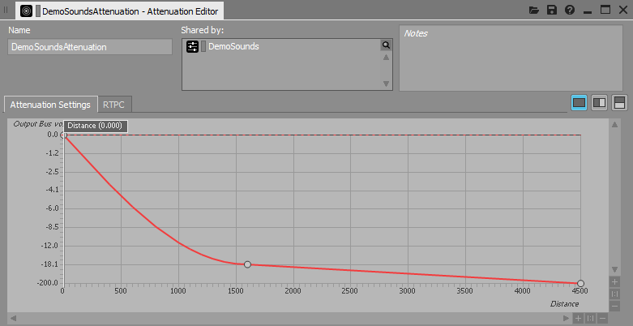

# Project Acoustics Unreal and Wwise sample

2022-12-06

In this sample, you'll experiment with Project Acoustics design controls by using sample content for the Unreal Engine and Wwise.

Software requirements for using the sample content:

- [Unreal Engine](https://www.unrealengine.com/) 4.26
- [AudioKinetic Wwise](https://www.audiokinetic.com/products/wwise/) 2021.1+

## Download the sample package

Download the [Project Acoustics Unreal and Wwise sample package](https://www.microsoft.com/download/details.aspx?id=58090). The sample package contains:

- Unreal Engine project
- Wwise project for the Unreal project
- Project Acoustics Wwise plug-in

## Set up the Project Acoustics sample project

First, install the Project Acoustics plug-in into Wwise. Next, deploy the Wwise binaries to the Unreal project. Then, adjust the Wwise Unreal plug-in to support Project Acoustics.

### Install the Project Acoustics Wwise plug-in

Open the Wwise Launcher. On the **Plugins** tab, under **Install New Plug-ins**, select **Add from directory**. Choose the AcousticsWwisePlugin\ProjectAcoustics directory that was included in the package that you downloaded.

### Add Wwise binaries to the Project Acoustics Unreal sample project

1. In Wwise Launcher, select the **Unreal Engine** tab.

2. Select the "hamburger" (icon) menu next to **Recent Unreal Engine Projects**, and then select **Browse for project**. Open the sample Unreal project .uproject file in the package AcousticsSample\AcousticsGame\AcousticsGame.uproject.

3. Next to the Project Acoustics sample project, select **Integrate Wwise in Project**.

### Extend Wwise Unreal plug-in functionality

> [!Note]
>
> This section only applies to versions of Wwise 2021 and lower. Skip this section if using Wwise 2022 or newer.

The Project Acoustics Unreal plug-in needs additional behavior exposed from the Wwise Unreal plug-in API. Run the batch file that came with the Project Acoustics Unreal plug-in to automate these modifications.

- Inside Plugins\ProjectAcousticsWwise\Resources, run PatchWwise.bat.

### Open the Unreal Project

When you open the Unreal project, it will prompt you to rebuild modules. Select **Yes**.

If opening the project fails because of build failures, check that you installed the Project Acoustics Wwise plug-in to the same version of Wwise that was used in the Project Acoustics sample project.

If you use a version of AudioKinetic Wwise earlier than version 2021.1, you can't generate sound banks by using the Project Acoustics sample project. You need to integrate Wwise version 2021.1 into the sample project.

## Experiment with Project Acoustics design controls

Listen to how the scene sounds by selecting the play button in the Unreal editor. Use the W, A, S, and D keys and the mouse to move around. To see keyboard shortcuts for additional controls, select F1.

The following information describes some design activities to try.

### Modify occlusion

There are per-source Project Acoustics design controls on each Unreal sound actor.

If the **Occlusion** multiplier is greater than 1 (the default is 1), occlusion is exaggerated. A setting of less than 1 makes the occlusion effect more subtle.

### Modify wetness for a source

To increase the decay time throughout the space, adjust **Decay Time Multiplier**. Consider a case where the simulation result is a decay time of 1.5 seconds. Setting **Decay Time Multiplier** to 2 results in a decay time of 3 seconds applied to the source.

Finer adjustment to the wetness levels for the source can also be controlled by the **Wetness Adjustment (dB)** setting. **Wetness Adjustment (dB)** will be added to the pre-computed reverb level that is looked up at runtime for the source.

### Modify distance-based attenuation

The Project Acoustics Wwise mixer plug-in respects the per-source distance-based attenuation that's built into Wwise. Changing this curve changes the dry-path level. The Project Acoustics plug-in will adjust the wet level to maintain the wet/dry mix specified by the simulation and design controls.

Project Acoustics computes in a "simulation region" box that's centered around each simulated player location. The acoustics assets in the sample package were baked with a simulation region radius of 45 meters. Attenuations were designed to fall to 0 before 45 meters. While this falloff isn't a strict requirement, it carries the caveat that only geometry within 45 meters of the listener will occlude sounds.

## Next steps

- [Integrate the Project Acoustics](./unreal-wwise-integration.md) plug-in into your Unreal project.
- [Create an Azure account](../Resources/create-azure-account.md) for your own bakes.
