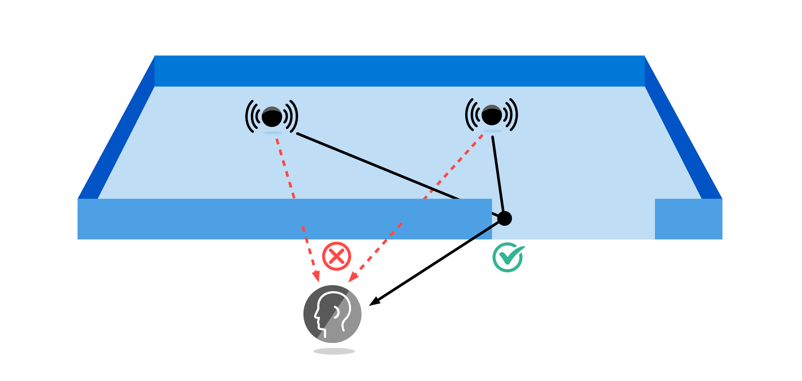

# project-triton

## Overview

### Immersive sound propagation for games and mixed reality

Games and mixed reality must render a believable soundscape for the listener that situates characters and sounds within rich 3D worlds. Project Triton aids this task by physically modeling how sound propagates within a scene given its shape and materials. In doing so, it automatically models immersive sound propagation effects like sound occlusion and reverberation. Project Triton is unique in accurately modeling the true wave physics of sound, including diffraction, while still being fast enough to scale from desktop to mobile devices. Incubated over a decade of focused research, it is battle-tested technology, shipping in major game titles like `Gears of War`, `Sea of Thieves`, and `Borderlands 3`.

[Project Acoustics](./what-is-acoustics.md) provides easy-to-use plugin integration for Unity and Unreal game engines.

### Sound propagation effects

- Obstruction

Sound is weakened when it diffracts around obstructions.

- Occlusion

Occlusion is total reduction in loudness from geometry, involving complex propagation and diffraction (diffracted paths in green).

- Portaling (sound redirection)

Sound heard “through the wall” (red) from source direction is incorrect. Doors redirect sounds, which is more believable.

- Reverberance

Left: Close to the source, direct path (green) is loud compared to reflections (orange), resulting in high clarity and low reverberance. Right: Behind the partition, direct path is weakened from diffraction, causing low clarity and high reverberance, conveying that the source is in a different room.

- Decay time

Larger rooms reverberate longer.

We perceive many acoustic effects in everyday life that result from the wave nature of sound propagation. They keep us aware and oriented in our surroundings, varying smoothly as we and sounds around us move through the world. Games and mixed reality thus usually need to reproduce them for a natural soundscape. Project Triton models many such important effects, illustrated above. For instance, obstruction and “portaling” together create a believable impression of sounds flowing around doorways. It is common for sound designers to have to do tedious manual markup to obtain such results. Project Triton removes this tedium, driving the effects robustly from scene geometry and empowering the designer with new tools to shape physics for storytelling goals. For example, one can reduce physical reverberance on game dialogue to make it cinematic, while heightening the reverberation on footsteps to make a cave feel spookier. All at runtime while fitting within practical CPU and RAM budgets.

### How it works

Project Triton models the actual wave physics of sound propagation through complex 3D spaces. Audible sounds have wavelengths from centimeters to meters so that wave effects must be modeled to avoid unnatural results. An example is the “lamppost problem” – a thin lamppost blocking the ray from source to listener can occlude as much as a concrete wall. We never hear that in reality because sound waves wrap around objects, as seen in the animation above. This is diffraction. It is central to how sound moves around corners and through doorways, scatters, and fills up various rooms with reverberation. Wave simulation is very expensive, so we precompute on static visual 3D geometry on a compute cluster in a “baking” step. The overall pipeline is quite analogous to light baking, in that it moves expensive global propagation computation to a baking step – with the difference that moving sources are supported. This data is passed through a proprietary parametric compressor that drastically reduces data size and enables fast lookup and signal processing at runtime, enabling Triton to run even on mobile devices such as the Oculus Go.
