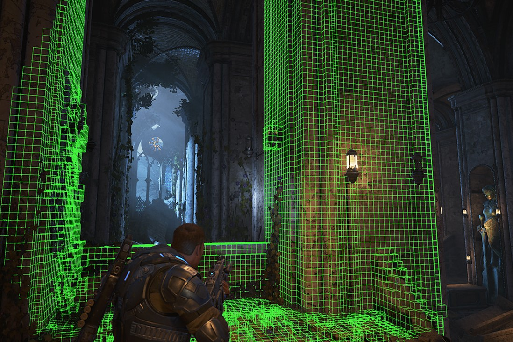

# What is Project Acoustics?

2023-02-03

#### In this article
- [Using wave physics for interactive acoustics](#using-wave-physics-for-interactive-acoustics)
- [Workflow](#workflow)
- [Setup](#setup)
- [Runtime platforms](#runtime-platforms)
- [Editor platforms](#editor-platforms)
- [Source licensing program update](#source-licensing-program-update)
- [Media](#media)
- [Contact us / Issue reporting](#contact-us--issue-reporting)
- [Download](#download)
- [Next steps](#next-steps)

Project Acoustics is a wave acoustics engine for 3D interactive experiences. It models wave effects like occlusion, obstruction, portaling and reverberation effects in complex scenes without requiring manual zone markup or CPU intensive raytracing. It also includes game engine and audio middleware integration. Project Acoustics' philosophy is similar to static lighting: bake detailed physics offline to provide a physical baseline, and use a lightweight runtime with expressive design controls to meet your artistic goals for the acoustics of your virtual world.

## Using wave physics for interactive acoustics

Ray-based acoustics methods can check for occlusion using a single source-to-listener ray cast, or drive reverb by estimating local scene volume with a few rays. But these techniques can be unreliable because a pebble occludes as much as a boulder. Rays don't account for the way sound bends around objects, a phenomenon known as diffraction. Project Acoustics' simulation captures these effects using a wave-based simulation. The acoustics are more predictable, accurate and seamless.

Project Acoustics' key innovation is to couple real sound wave based acoustic simulation with traditional sound design concepts. It translates simulation results into traditional audio DSP parameters for occlusion, portaling and reverb. The designer uses controls over this translation process. For more details on the core technologies behind Project Acoustics, visit the [research project page](./project-triton.md).

## Workflow

- **Pre-bake**: Start with setting up the bake by selecting which geometry responds to acoustics by, for example, ignoring light shafts. Then edit material assignments and select navigation areas to guide listener location sampling. There's no required markup for reverb/portal/room zones. Debug displays help show which data will be included in the bake process before performing the bake.
- **Bake**: The acoustic simulation requires intensive computational power. The data files produced by the prebake are sent to Azure to accelerate the simulation process. Once completed, the resulting acoustics information is downloaded into your project as a game asset.
- **Runtime**: Load the acoustics game asset into the Project Acoustics plugin. Design the acoustics live in editor using granular per-source controls, either via UI controls or code.

## Setup

[Project Acoustics Unity Plugins Overview](#) describes our two plugin offerings for Unity: Project Acoustics for Unity Audio, and Project Acoustics for Unity/Wwise.

[Project Acoustics Unreal Plugins Overview](./UnrealEngine/unreal-overview.md) describes our two plugin offerings for Unreal: Project Acoustics for Unreal/Wwise and Project Acoustics for Unreal Audio.

## Runtime platforms

The Project Acoustics runtime plugins can currently be deployed to the following platforms:

- Windows
- Xbox
- Android
- MacOS

## Editor platforms

The Project Acoustics editor plugin is available for the following platforms:

- Windows

## Source licensing program update

As Project Acoustics continues to evolve, the team has been interested in gaining an understanding for how the project can provide impact to others. One of the ways that we have gained a better understanding of the project is by having deeper collaborations with partners by providing access to the source code.

This pilot program has allowed us to gain valuable insights into the potential for the technology. The Project Acoustics team is no longer accepting new partners for the source code access program. We appreciate those who have participated in this program. The valuable insights our partners have provided through this program have made the project better in innumerable ways.

Existing partners that currently have access to the source code will continue to have access and can continue to utilize the code for their ongoing projects, although we will no longer be providing source code updates. In addition, the publicly available binary tools on Microsoft's Download Center and Unreal Marketplace will continue to be available and supported.

## Media

[Microsoft Project Acoustics UE5 Marketplace Plugin with Epic](https://www.youtube.com/watch?v=3uocCX0AMIg)

## Contact us / Issue reporting

- [Project Acoustics discussion and issue reporting](https://github.com/microsoft/ProjectAcoustics/issues)

## Download

- [Project Acoustics Unity plugin and samples](https://www.microsoft.com/en-us/download/details.aspx?id=57346)
- [Project Acoustics Unreal & Wwise plugins and samples](https://www.microsoft.com/download/details.aspx?id=58090)
  - For Xbox binaries and other support, contact us via the [forum](https://github.com/microsoft/ProjectAcoustics/issues).
- [Project Acoustics for Unreal Audio Marketplace Plugin](https://unrealengine.com/marketplace/en-US/product/06cfe91228c04848a0f6d6f7fb7b40f0) with [UE5 Sample Scene](https://www.microsoft.com/en-us/download/details.aspx?id=104115)

## Next steps

- Try [Project Acoustics for Unity](#)
- Try [Project Acoustics for Unreal](./UnrealEngine/unreal-overview.md)
- Explore the [sound design philosophy of Project Acoustics](./Resources/design-process.md)
